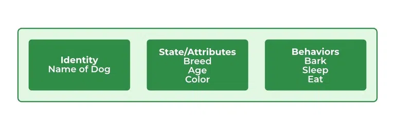
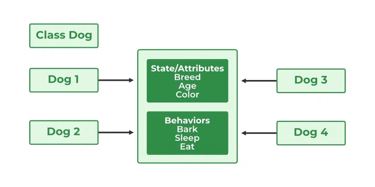
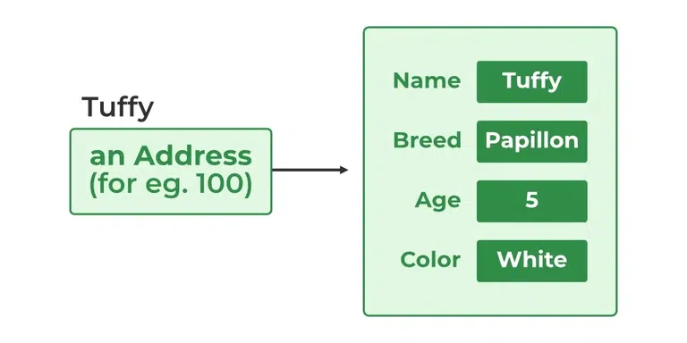

# Class và object trong java

**Khái niệm**

Trong **java**, **class** và **object** là khái niệm cơ bản của lập trình hướng **object** rằng được sử dụng để đại diện cho thế giới thực phận biệt giữa **khái niệm** và **thực thể**. **Class** đại diện cho nhóm **object** có *thuộc tính và hành vi giống nhau*.

Ví dụ:

Loại động vật "con chó" là **Class** trong khi "*một con chó cụ thể*" có tên là "*Tommy*" là **object** của **Class** "*con chó*".

<br/>

Trong bài này, chúng ta sẽ thảo luận về java **object** và **class** và cách để **implement** chúng trong chương trình của chúng ta.

## Java Class

Một **Class** trong java là một tập hợp **object** cho phép chia sẽ *đặc tính/hành vi* và *thuộc tính* một cách **tổng quát**.

CLass là một **bản thiết hoặc Nguyên mẫu** kế do người dùng định nghĩa từ đó **object** được tạo ra.

Ví dụ:

"**Học sinh**" là một **class** trong khi một **Học sinh** *cụ thể* có tên là **Ravi** là một **object**

<br />

*Thuộc tính của Class:*

- 1. **CLass** không phải là một **thực thể có thực**. nó chỉ là một **bản mẫu** hoặc **bản thiết kế** hoặc **nguyên mẫu** từ đó **object** được tạo ra.
- 2. **Class** không chiếm bộ nhớ (ram).
- 3. **Class** là *một nhóm* **các variable có loại dữ liệu khác nhau** và *một nhóm* **method**
- 4. Một **Class** có thể chứa:
    - 4.1. Data thành viên.
    - 4.2. Method.
    - 4.3. Constructor (hàm khởi tạo).
    - 4.4. Class **lòng nhau**
    - 4.5. Interface.

<br />

**Định nghĩa class trong java:**
```
Quyền_truy_cập class <tên_class>
{
    data thành_viên;
    method;
    constructor;
    class lồng_nhau;
    interface;
}
```

<br />

**Ví dụ cho java class**:

Ví dụ 1:
```java
class Student {
    // data thành_viên (là thể_hiện của variable)
    int id;
    // data thành_viên (là thể_hiện của variable)
    String name;

    public static void main(String args[])
    {
        // tạo một object Student
        Student s1 = new Student();
        System.out.println(s1.id);
        System.out.println(s1.name);
    }
}
```
Output:
```
0
null
```

Ví dụ 2:
```java
/// Chương_trình java minh_họa việc_tạo_object

//Main class
class GFG {
    // Khai_báo và khởi_tạo string
    String name = "Wislam";

    // Main method
    public static void main(String[] args) 
    {
        // Khối Try để_kiểm_tra exceptions (các_ngoại_lệ)
        try {
            Class cls = Class.forname("GFG");
            // Tạo object có main class sử_dụng instance method
            GFG obj = (GFG)cls.newInstance();
            // In và hiển_thị
            System.out.println(obj.name);
        }
        catch (ClassNotFoundException e) {
            e.printStackTrace();
        }
        catch (InstantiationException e) {
            e.printStackTrace();
        }
        catch (IllegalAccessException e) {
            e.printStackTrace();
        }
    }
}
```
Output:
```
Wislam
```

Ví dụ 3:
```java
// Chương_trình java minh_họa việc_tạo object
// Sử_dụng clone() method
// Main class
// Triển_khai Cloneable interface
class GFG implements Cloneable {

    // Method 1
    @Override
    protected Object clone()
        throws CloneNotSupportedException
    {
        // Super() keyword để_cập đến class_cha
        return super.clone();
    }
    String name = "Wislam";
    // Method 2
    // main method
    public static void main(String[] args)
    {
        GFG obj1 = new GFG();
        // Khối Try kiểm_tra exceptions
        try {
            GFG obj2 = (GFG)obj1.clone();
            System.out.println(obj2.name);
        }
        catch (CloneNotSupportedException e) {
            e.printStackTrace();
        }
    }
}
```
Output:
```
Wislam
```

<br />

**Các thành phần của Java Classes**

Trong tổng quát, việc định nghĩa **Class** có thể bao gồm các thành phần này để:
 - 1. **Modifiers**: Một **Class** có thể được public hoặc có default quyền_truy_cập.
 - 2. **Class keyword**: được sử dụng để tạo class
 - 3. **Class name**: Cái tên nên bắt đầu với một ký tự Viết_Hoa (Theo quy ước java).
 - 4. **Superclass(Nếu có)**: Cái tên của Class_cha (superclass), nếu có, đi trước bởi keyword **extends**. Một class chỉ có thể extends (subclass) một cha.
 - 5. **Interfaces(nếu có)**: Một danh sách interface được phân_cách bằng dấu_phẩy được **implements** bởi **Class**, nếu có, đi_trước bởi keyword **implements**.
 - 6. **Body**: thân_bài class được bao_bọc bởi braces, {}.

 <br />

**Constructors** được sử_dụng để khởi tạo objects mới. Fields(Trường_nhập_dữ_liệu) là variables (các_biến) cung cấp tình_trang(state) của Class và objects của nó, method được sử dụng để triển khai hành_vi của Class và objects của nó.

Có nhiều loại Class mà được sử dụng trong các ứng dụng thời_gian_thực(real-time) như: nested_classes(Class lồng_nhau), anonymouse_classes(Class ẩn_danh), và lambda_expressions(biểu_thức lambda).

<br />

## Java Object

Một object trong java là đơn_vị(unit) cơ bản của (OOP) và đại diện cho thực thể trong cuộc_sống_thực(real-life).

Objects là thể_hiện của một Class rằng được tạo để sử dụng thuộc tính và methods trong class.

Một chương trình java thông thường tạo nhiều objects, mà như bạn biết, tương tác bởi lời_gọi methods. Một object chứa các thứ sau:
- 1. **State**: nó được đại diện bởi thuộc_tính(attributes) của một object. nó cũng phản ánh thuộc_tính(properties) của một object.
- 2. **Hành_vi(Behavior)**: nó được đại diện bởi methods của object. nó cũng phản ánh Sự phản hồi của một object với một object khác.
- 3. **Danh_tính(Identity)**: nó đặt một cái tên độc_nhất cho một object và cho phép một object tương tác với một object khác.

<br />

**Ví dụ về object: "Dog(Chó)"**



<br />

Objects Tương đương với những thứ được tìm thấy trong thế_giới_thực(real-world).

Ví dụ, **một chương trình đồ họa** có thể có object chẳng hạn như "**Hình_tròn(circle)**", "**Hình_vuông(square)**", và "**menu**". Một **hệ thống cửa hàng online** có thể có objects chẳng hạng như "**Giỏ_hàng(shopping cart)**", "**khách_hàng(customer)**", và "**sản_phẩm(product)**".

*Note*:

`khi chúng ta tạo một object là một loại dữ liệu không nguyên_thủy(primitive), nó luôn cấp phát trên bộ_nhớ(memory) heap`

<br />

**Khai báo Objects (Cũng được gọi là Thể_hiện của một Class)**

Khi một object của class được tạo, **Class** được nói rằng là trở thành "Thể_hiện". Tất cả "thể_hiện"(instances) chia sẽ thuộc_tính(attributes) và hành_vi(behavior) của **Class**. Nhưng giá_trị của các thuộc_tính(attributes) đó, tức là **state** là độc nhất đối với mỗi object. Một **Class** có thể có bất kỳ số lượng "thể_hiện(instances)".

Ví dụ:



<br />

Như chúng ta khai báo biến như (type(loại_dữ_liệu) name;). Thông báo biên_dịch(compiler) này rằng chúng ta sẽ sử dụng name(cái_tên) để đề_cập đến loại_dữ_liệu(data) là type.

Với biến(variable) nguyên_thủy(primitive), khai báo này cũng dữ_trữ(reserves) "số lượng bộ nhớ thích_hợp(proper)" cho biến(variable).

Vì vậy đối với Biến_tham_chiếu(variable reference), loại_dữ_liệu(type) phải được một_cách_chặt_trẻ(strictly) với tên_class_cụ_thể(concrete class name). Trong tổng quát, chúng ta không thể tạo objects của một **abstract class** hoặc **interface**.
```java
Dog tuffy;
```
Nếu chúng ta khai báo 1 biến_tham_chiếu(reference variable) tuffy như thế này, giá_trị của nó sẽ không_được_xác_định(undetermined) tức_là null cho đến khi một object thực sự được tạo và chuyển_nhượng(assigned) nó.

Một cách đơn giản khai báo 1 biến_tham_chiếu(reference variable) không tạo object.

<br />

**Khởi tạo một java object**

Toán_tử_khởi_tạo(operator instantiates) một class mới bằng việc cấp phát bộ nhớ cho một object mới và việc trả về 1 tham_chiếu(reference) đến bộ_nhớ đó(memory). Toán_tử(operator) mới cũng gọi(invokes) **Class constructor**.

Ví dụ:
```java
// Khai_báo class

public class Dog {
    // Biến Thể_hiện
    String name;
    String breed;
    int age;
    String color;

    // Khai_báo Constructor
    public Dog(String name, String breed, int age,
               String color)
    {
        this.name = name;
        this.breed = breed;
        this.age = age;
        this.color = color;
    }

    // method 1
    public String getName() { return name; }

    // method 2
    public String getBreed() { return breed; }

    // method 3
    public int getAge() { return age; }

    // method 4
    public String getColor() { return color; }

    @Override public String toString()
    {
        return ("Chào tên của tôi là " + this.getName()
                + ".\nGiống_loài(breed), tuổi và màu sắc là  "
                + this.getBreed() + "," + this.getAge()
                + "," + this.getColor());
    }

    public static void main(String[] args)
    {
        Dog tuffy
            = new Dog("tuffy", "papillon", 5, "white");
        System.out.println(tuffy.toString());
    }
}
```
Output:
```
Chào tên của tôi là tuffy.
Giống_loài(breed), tuổi và màu sắc là papillon,5,white
```

<br/>

**Khởi tạo bằng việc sử dụng method/function**:
```java
public class GFG {
    // sw=software(phần_mền)
    static String sw_name;
    static float sw_price;

    static void set(String n, float p)
    {
        sw_name = n;
        sw_price = p;
    }

    static void get()
    {
        System.out.println("Software name is: " + sw_name);
        System.out.println("Software price is: "
                           + sw_price);
    }

    public static void main(String args[])
    {
        GFG.set("Visual studio", 0.0f);
        GFG.get();
    }
}
```
Output:
```
Software name is: Visual studio
Software price is: 0.0
```

<br />

Đây là class chứa một **constructor**. Chúng ta có thể nhận_ra(recognize) một **constructor** bởi vì khai_báo của nó sử_dụng tên giống_như tên_class và nó không có trả_về(return) loại_dữ_liệu(type). 

Biên_dịch_java(Java compiler) phân_biệt(differentiates) **constructor** dựa trên số(number) tham_số và loại_dữ_liệu(type) tham_số(arguments).

Constructor trong class Dog lấy 4 tham_số(arguments).

Tuyên_bố(statement) sau(following) cung_cấp "tuffy", "papillon",5, và "white" như giá_trị(values) cho các tham_số đó.
```
Dog tuffy = new Dog("tuffy","papillon",5, "white");
```


*Note*:

`Tất cả Class có ít nhất một constructor. nếu một class bất_kỳ không được khai_báo một_cách_rõ_ràng, Biên_dịch_java một_cách_tự_động cung_cấp 1 không_tham_số constructor, cũng được_gọi_là default constructor. Default constructor này gọi Class_cha không_tham_số construtor (khi nó chỉ chứa một statement tức_là(i.e) super();, hoặc Object class constructor nếu class không_có cha_khác (khi Object class là cha của tất_cả Class một_cách_trực_tiếp hoặcc một_cách_gián_tiếp`

<br />

**Cách tạo Objectt của một Class**

Có 4 cách tạo object trong Java. Việc_nói một_cách_chặt_trẽ, chỉ có một cách(bằng việc sử dụng keyword **new**), và phần_còn_lại bên_trong sử_dụng từ_khóa **new**.

*1. sử dụng keyword **new***

Nó là cách thông_dụng và tổng_quát nhất để tạo một object trong java.

Ví dụ:
```java
// Tạo object class Test
Test t = new Test();
```

*2. Sử dụng **Class.forName(String className)** method*

Có một định_nghĩa_trước Class trong java.lang package với tên Class. forName(String className) method trả_về Class Object liên_quan với Class với tên String được_cho.

chúng ta phải cho một tên đặt_tiêu_chuẩn(qualified) đối_với một class một_cách_đầy_đủ.

Việc gọi **new instance()** method trên classs object này trả_về(returns) một thể_hiện mới của class với tên String được_cho.

```java
// Tạo object của class public Test
// Xem_xét class Test trình_bày trong com.p1 package
Test obj = (Test)Class.forName("com.p1.Test").newInstance();
```

*3. Việc sử dụng **clone()** method*

clone() method được trình_bày trong Object class. nó tạo và trả về một copy của object.

```java
// Tạo object của Class Test
Test t1 = new Test();
// Tạo clone của object trên
Test t2 = (Test)t1.clone();
```

*4. Deserialization*

De-serialization là kỹ thuật của việc đọc một một object từ một state được_save trong một file. Để_cập đến Serialization/De-Serialization trong Java.

```java
FileInputStream file = new FileInputStream(filename);
ObjectInputStream in = new ObjectInputStream(file);
Object obj = in.readObject();
```

<br />

**Việc tạo nhiều objects chỉ bằng một loại_dữ_liệu(A good practive)**

Trong thời_gian_thực, chúng ta cần các object khác của một class trong một methods khác.

Việc tạo một số_tham_chiếu(number of references) cho việc_lưu chúng là một cách không (good practive) và do đó chúng ta khai_báo một static biến_tham_chiếu và sử_dụng nó bất cứ khi nào cần.

Trong trường hợp này, Sự_lãng_phí(wastage) bộ nhớ là ít. Object đó không được_Tham_chiếu nữa sẽ bị_phá_hủy bởi (Garbage Collector) của java

<br />

Ví dụ:
```java
Test test = new Test();
test = new Test();
```

Trong hệ thống kế_thừa, chúng ta sử dụng một class_cha biến_tham_chiếu để lưu_trữ một sub-class object. Trong trường_hợp này, chúng ta có thể chuyển thành subclass objects khác sử_dụng biến_tham_chiếu giống_nhau.

Ví dụ:
```java
class Animal {}
class Dog extends Animal {}
class Cat extends Animal {}
public class Test
{
    // Sử_dụng Dog object
    Animal obj = new Dog();
    // Sử_dụng Cat object
    obj = new Cat();
}
```

**Anonymous Objects in Java**

Anonymous objects là các objects được_khởi_tạo nhưng không_được_lưu trong biến_tham_chiếu.
- Chúng được_sử_dụng cho **method gọi ngay_lập_tức**.
- Chúng sẽ **bị_phá_hủy sau_khi gọi method**.
- Chúng được **sử dụng một_cách_rộng_rãi** trong nhiều_thư_viện khác_nhau. Ví dụ, trong AWT libraries, chúng được_sử_dụng để thực hiện một_vài hành_động dựa_trên chụp(capturing) một event(tức_là một nút bấm).
- Trong ví dụ dưới, khi một nút_khóa(key button) được nhấn, chúng **đơn giản tạo một anonymous object của EventHandler class cho việc chỉ gọi method xử_lý(handle)**.

```java
// btn is button (nút_bấm hoặc nút_nhấn)
btn.setOnAction(new EventHandler()
{
    public void handle(ActionEvent event)
    {
        System.out.println("Hello World!");
    }
});
```

<br />

## Sự khác biệt giữa Java Class và Object

| Class | Object |
| - | - |
| Class là một bản_thiết_kế của object. Nó cũng được sử dụng để tạo objects. | Một object là một thể_hiện của Class|
| Không có bộ nhớ nào được cấp phát khi một class được định nghĩa. | Bộ nhớ được cấp phát ngay khi một object được tạo. |
| Một Class là một nhóm của các object giống nhau | Một object là một thực_thể trong thế_giới_thực chẳng hạn như book, car, v.v. |
| Một class có thể chỉ được định nghĩa một lần. | Object có thể được tạo nhiều lần mỗi khi cần. |
| Một ví dụ về class có thể là một Chiếc_xe_hơi | Object của class Chiếc_xe_hơi có thể là BMW, Mercedes, Ferrari, etc. |
