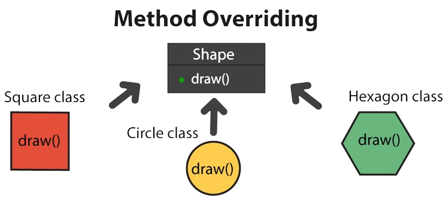

**Slide**: https://github.com/PressSay/LearningJava/blob/master/Java%20inheritance.pdf

**Youtube**:

<br/>

# Java Inheritance

<br />

**Định nghĩa**: Kế thừa là một cơ chế trong đó một lớp con (subclass) kế thừa các thuộc tính và phươngthức KHÔNG private của một lớp cha (superclass).

**Mục đích**: Tái sử dụng mã nguồn, tổ chức mã một cách hiệu quả hơn, và dễ dàng bảo trì.

<br />

<br />

## Truy cập

<br />

**PRIVATE**
- Chỉ có thể truy cập trong cùng một class.
- Không thể truy cập từ subclasses hay từ bất cứ nơi nào khác.

**PROTECTED**
- Có thể truy cập trong cùng một package và các subclass, ngay cả khi các subclass nằm ở các package khác nhau.

**PUBLIC**
- Có thể truy cập từ bất kỳ đâu

<br />

<br />

## Ghi Đè Phương Thức (Method Override)

<br />

**Định nghĩa**: 

Khi một subclass có method trùng tên, kiểu trả về và tham số với method trong superclass.

**Mục đích**: 

Cho phép subclass cung cấp cách triển khai cụ thể của một method đã được định nghĩa trong superclass.

**Sử dụng @Override**: 

Annotations để đảm bảo rằng method đang ghi đè method của superclass.



<br />

<br />

## Tính Đa Hình (Polymorphism)

**ĐỊNH NGHĨA**

Khả năng của một đối tượng có thể hành xử khác nhau dựa trên ngữ cảnh gọi.

**COMPILE-TIME POLYMORPHISM**

Sử dụng nạp chồng (method overloading).

ví dụ
```java
int myMethod(int x)
float myMethod(float x)
double myMethod(double x, double y)
```

**RUNTIME POLYMORPHISM**

Sử dụng ghi đè (method overriding) để quyết định phương thức nào sẽ được gọi tại thời điểm chạy.

<br />

<br />

## Ví dụ
```java
class Animal {
  protected void makeSound() {
    System.out.println("Animal sound");
  }
}
class Dog extends Animal {
  @Override
  public void makeSound() {
    System.out.println("Woof!");
  }
}
public class Main {
  public static void main(String[] args) {
    Animal myDog = new Dog();
    myDog.makeSound(); // Output: Woof!
  }
}
```

<br />

<br />

*More*

**Animal.java**
```java
package models;

public class Animal {

    private String name;
    protected int soLuongChi;

    Animal(int soLuongChi, String name) {
        this.soLuongChi = soLuongChi;
        this.name = name;
    }

    public void displaySLChi() {
        System.out.println("Animal " + this.name + " have " + this.soLuongChi);
    }

    public void makeSound() {
        System.out.println("Animal make sound");
    }

    public int makeSound(int x) {
        return 0;
    }

}
```

<br />

**Cat.java**
```java
package models;

public class Cat extends Animal {

    public Cat(int soLuongChi, String name) {
        super(soLuongChi, name);
    }


    @Override
    public void makeSound() {
        super.makeSound();
        System.out.println("meow");
    }
}
```

<br />

**Dog.java**
```java
package models;

public class Dog extends Animal {

    public Dog(int soLuongChi, String name) {
        super(soLuongChi, name);
    }

    @Override
    public void makeSound() {
        System.out.println("woof!");
    }

}
```

<br />

```java
import models.Animal;
import models.Cat;
import models.Dog;

public class Main {
    public static void main(String[] args) {
        Object cat = new Cat(4, "myCat");
        Animal dog = new Dog(4, "myDog");

        boolean isDog = cat instanceof Dog;
        boolean isCat = cat instanceof Cat;

        System.out.println("Object cat is Dog: " + isDog);
        System.out.println("Object cat is Cat: " + isCat);

        // public Classes -> subClasses -> outside_Package -> inside_Package
        // protected classes -> subclasses -> inside_Package
        // private classes
//        System.out.println(cat.soLuongChi);

//        cat.displaySLChi();
//        dog.displaySLChi();
//
//        cat.makeSound();
//        dog.makeSound();

    }
}
```
